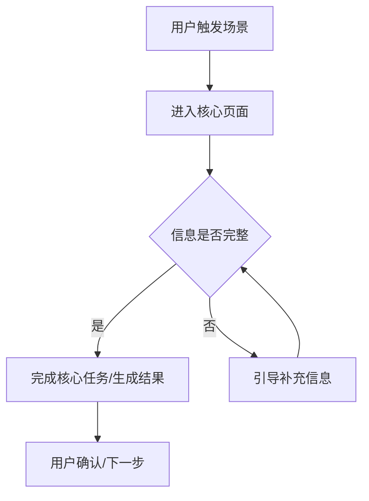

# PRD v0 模板

PRD v0 是产品定义稿,不是研发交付 PRD。每个小节都要区分:已确认 / 推断 / 待验证。AI 产品必须先定义 Samples/Eval,再从具体 case 抽象共同能力,最后产出两图一表:原型草图、流程/状态图、数据表。

## 1. 一句话定义

[产品/功能] 帮助 [目标用户] 在 [场景] 下解决 [核心问题],通过 [核心方式] 达到 [目标结果]。

## 2. 背景与问题

- 背景:
- 当前问题:
- 现有方案:
- 为什么现有方案不够好:
- 证据状态:已确认 / 推断 / 待验证

## 3. 目标用户与核心场景

| 用户群 | 场景 | 痛点强度 | 现有替代方案 | 备注 |
| --- | --- | --- | --- | --- |
|  |  | 高/中/低 |  |  |

## 4. 目标与非目标

目标:

- 

非目标:

- 

## 5. 核心假设

| 假设 | 为什么关键 | 如何验证 | 当前状态 |
| --- | --- | --- | --- |
|  |  |  | 已确认/推断/待验证 |

## 6. Dataset: Samples + Context

Sample 是需求的原子。每条 case 必须带完整 context,不能只有一句 query。

| Case | 用户画像 | 当下情境 | 用户输入/任务 | 期望输出 | 风险点 | 证据状态 |
| --- | --- | --- | --- | --- | --- | --- |
|  |  |  |  |  |  | 已确认/推断/待验证 |

覆盖性检查:

- 覆盖的用户类型:
- 覆盖的高频场景:
- 覆盖的高风险场景:
- 还缺的 case:

## 7. Rubric: 什么算好

| 维度 | 必须满足 | 好的表现 | 不可接受 | 优先级 |
| --- | --- | --- | --- | --- |
| 安全/合规 |  |  |  | P0/P1/P2 |
| 准确性 |  |  |  | P0/P1/P2 |
| 完整性 |  |  |  | P0/P1/P2 |
| 个性化/上下文理解 |  |  |  | P0/P1/P2 |
| 可执行性 |  |  |  | P0/P1/P2 |

## 8. Metric / Judge / Protocol: 完成标准

| 项目 | 定义 |
| --- | --- |
| Metric | 例如风险识别召回率、不当建议出现率、任务完成率、工具调用成功率、用户满意度 |
| 阈值 | 例如风险识别召回率 >= 95%, 不当建议出现率 = 0 |
| Judge/Evaluator | 人工 / 专家 / LLM-as-a-Judge / 规则程序 / 线上 feedback |
| Protocol | 是否允许联网、工具调用、多轮追问、人工确认、采样次数、盲评方式 |

Agent 场景补充 eval trace:

- 工具是否选对:
- 参数是否正确:
- 中间状态是否一致:
- 出错后是否能纠正:
- token/延迟/费用是否可接受:

## 9. 共同能力抽象

从上面的 cases 抽象出产品需要具备的共同能力。不要脱离 sample 空谈能力。

| 共同能力 | 来自哪些 case | 能力边界 | 对应 Rubric/Metric |
| --- | --- | --- | --- |
|  |  |  |  |

## 10. 推荐方案与取舍

推荐方案:

- 

取舍:

- 选择了什么:
- 放弃了什么:
- 为什么:

## 11. MVP 功能范围

必须有:

- 

可以后置:

- 

明确不做:

- 

## 12. 图一:原型草图

```text
[页面/功能名称]
┌──────────────────────────────┐
│ 顶部区域: 标题 / 核心价值 / CTA │
├──────────────────────────────┤
│ 模块 A: 任务 / 内容 / 操作       │
├──────────────────────────────┤
│ 模块 B: 反馈 / 结果 / 下一步     │
└──────────────────────────────┘
```

说明:

- 主模块:
- 主 CTA:
- 必须展示:
- 可以后置:

## 13. 图二:流程/状态图



关键状态:

- 

异常/回退路径:

- 

## 14. 一表:数据表

选择最适合当前产品的一种或多种表:评测样本表、业务对象表、漏斗/转化表、指标表、权限/角色表。

| 对象/步骤/指标 | 字段/状态 | 当前值/目标值 | 说明 | 证据状态 |
| --- | --- | --- | --- | --- |
|  |  |  |  | 已确认/推断/待验证 |

## 15. 成功标准

| 指标 | 目标 | 为什么看它 |
| --- | --- | --- |
|  |  |  |

## 16. 风险与待验证问题

- 

## 17. 下一步建议

推荐下一步:

- 进入 `idea-to-frontend` 做 PRD-to-Frontend / 界面原型探索
- 或继续用户访谈 / 数据调研 / `product-decision`

选择理由:

- 
