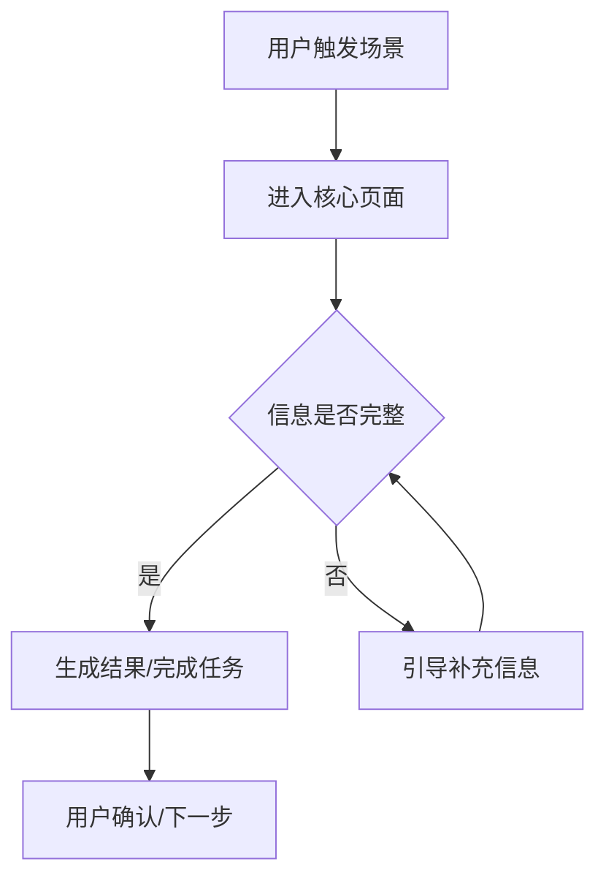

# 两图一表

目标:把 PRD v0 从纯文字变成 AI 和人都能快速理解的中间表达。两图一表不是设计稿,也不是研发详细方案;它是把产品经理脑中的结构、流程、评测样本和数据对象显性化。

两图一表必须建立在 Samples/Eval 之后:

```text
具体 cases -> Dataset/Rubric/Metric -> 共同能力 -> 两图一表
```

不要先画页面再倒推能力。先看具体 sample 中反复出现的任务、风险、状态和判断标准,再决定页面模块、流程状态和数据表。

## 图一:原型草图

用途:快速表达"心中构想的样子",突出模块与顺序。

必须说明:

- 页面/功能包含哪些主要模块。
- 模块的上下顺序或左右关系。
- 每个模块承载什么用户任务。
- 主 CTA 在哪里。
- 哪些内容是必须展示,哪些可以后置。
- 哪些模块对应哪些 sample 或共同能力。

推荐形式:

- ASCII wireframe
- 低保真页面结构图
- Axure / Figma / Sketch / 白板草图描述

输出要求:

```text
[页面/功能名称]
┌──────────────────────────────┐
│ 顶部区域: 标题 / 核心价值 / CTA │
├──────────────────────────────┤
│ 模块 A: ...                   │
├──────────────────────────────┤
│ 模块 B: ...                   │
└──────────────────────────────┘
```

## 图二:流程/状态图

用途:讲明白业务模式、数据流转、pipeline 与状态边界。

必须说明:

- 用户从哪里进入。
- 系统/AI/人工分别做什么。
- 关键状态有哪些。
- 状态之间如何流转。
- 哪些路径是异常、失败、回退或待补充。
- 哪些节点需要被 eval answer 或 eval trace 评测。

推荐形式:

- Mermaid flowchart / stateDiagram
- draw.io 结构说明
- 飞书文档流程图

优先用 Mermaid,因为它可以直接成为后续 prompt 和文档素材:



## 一表:数据表

用途:让 AI 理解业务现状、评测样本、分析数据、转化率/漏斗关系和核心对象。

至少选择一种表:

1. **评测样本表**:代表性 sample、context、期望输出、风险点、rubric、metric。
2. **业务对象表**:这个产品里有哪些核心对象、字段和状态。
3. **漏斗/转化表**:当前流程每一步的转化、流失和判断标准。
4. **指标表**:成功标准、观察指标、口径和数据来源。
5. **权限/角色表**:不同角色能看什么、做什么。

推荐格式:

| 对象/步骤/指标 | 字段/状态 | 当前值/目标值 | 说明 | 证据状态 |
| --- | --- | --- | --- | --- |
|  |  |  |  | 已确认/推断/待验证 |

## 产出原则

- 两图一表是 PRD v0 的一部分,不是可选附录。
- 信息不完整时也要画,但标出"待验证"。
- 图表优先表达结构和边界,不要追求视觉精致。
- AI 产品优先补评测样本表;传统确定性功能可以优先补业务对象表或流程表。
- 两图一表要能直接喂给后续 `prd-to-frontend`,作为高质量 Prompt 的核心材料。
